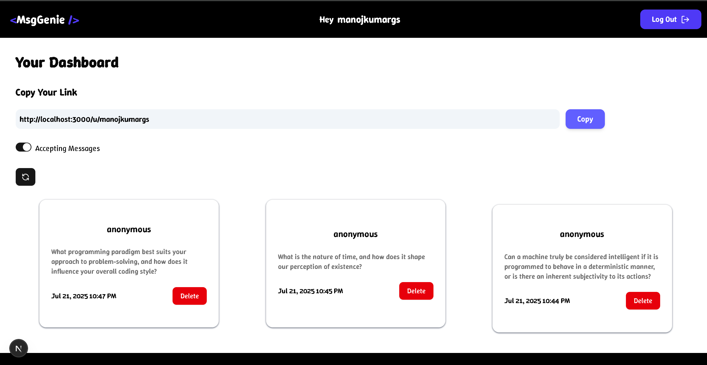

# 💬 MsgGenie — Create Your Personal Message Link

A full-stack, TypeScript-powered web app where users can receive anonymous messages through a shareable link. Anonymous users can use AI to get message suggestions and send them directly — securely and privately.

---

## 🖼️ UI Screenshots

### 🏠 Home Page


### 📊 Dashboard Page


## ✨ Features

- ✅ Account creation with email verification  
- 🔐 Secure sign-in (Credentials, Google, GitHub via `next-auth`)  
- ⚙️ Toggle "Accepting Messages" from dashboard  
- 📬 Anonymous messaging via shareable user link  
- 🤖 AI-suggested messages for anonymous users  
- 📥 View and 🗑️ Delete messages from dashboard  
- 🛡 Secure password handling with `bcryptjs`  
- 🧠 Smart form UX with `zod` validation + debounce username check  
- ⚡ Optimized MongoDB queries (DB-level fetch/update)  
- 🧩 Middleware to protect routes (e.g., `/dashboard`)  
- 🟦 Built entirely with **TypeScript** for type safety  

---

## 🛠 Tools & Technologies Used

### 🔧 Frontend
- **Next.js** (App Router)  
- **Tailwind CSS** (Fully responsive UI)  
- **TypeScript** (Static type checking)  
- **React Hook Form** + **Zod** (Schema-based form validation)  
- **usehooks-ts** (Debounced input & other custom hooks)  

### 🔐 Authentication
- **NextAuth.js**
  - Credentials provider  
  - Google OAuth  
  - GitHub OAuth  
- **JWT Session Strategy** (Lightweight & scalable)  
- **Custom JWT and Session callbacks**  

### 🧠 Backend & AI
- **MongoDB** with **Mongoose** (Optimized DB access)  
- **LLM API** for AI-generated message suggestions (custom prompts)  
- **MongoDB Aggregation Pipelines** for optimized reads  
- **MongoDB Update Operators** for direct updates (no over-fetching)  

---

## ⚙️ How to Run Locally

### 1. 🚀 Clone the Repository

```bash
git clone https://github.com/Manoj-kumar-gs/Msg_Genie.git
cd Msg_Genie


### 2. 📦 Install Dependencies

npm install
# or
yarn install

### 3. ⚙️ Set Up Environment Variables
Create a .env.local file in the root directory and add the following:

MONGODB_URI=your_mongodb_connection_string
NEXTAUTH_SECRET=your_nextauth_secret
NEXTAUTH_URL=http://localhost:3000

EMAIL_SERVER_USER=your_email_address
EMAIL_SERVER_PASSWORD=your_email_password
EMAIL_FROM=your_email_address

AI_API_KEY=your_llm_api_key


### 4. run the development server:

npm run dev
# or
yarn dev
# or
pnpm dev
# or
bun dev
```

Open [http://localhost:3000](http://localhost:3000) with your browser to see the result.